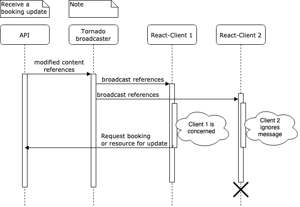

# Reservations
This software allows its users to book resources for a given time.

## installation
This software has been developed under python3.6. To install run the 
following commands:

```shell
virtualenv -p python3.6 env
source env/bin/activate
pip install -r requirements.txt
# Using debug mode since this doesn't come with staticfiles hosting.
export DEBUG=true 
python manage.py migrate
# Make sure the code runs properly and has no foreseen failures
python manage.py test
# load admins, basic-users and testing assets from dumped data
python manage.py loaddata fixtures/*.json
```
for part 2 ONLY you'll need two extra steps to build the react app:
```
# build react app and inject built file into app's static files
./build-and-inject
# collect staticfiles
DEBUG=no python manage.py collectstatic --noinput
```

Then you can run the app
```
python manage.py runserver
```

## Features
- Admin access to create resources
- User can create a "booking"
- User can view his past, present and future bookings 
- User can cancel one of his upcoming/current bookings

## Database
The project's database is simple and relies on four models split in 3 apps:

- Users
- UserPreference
- Resources
- Bookings (binding users and resources)

The chosen database is sqlite for installation simplicity but if this had to
run under production constraints I would certainly reconsider this choice.

The following diagram sums things up:


## Code structure
Priority has been given to separation of concers knowing this app could 
grow really fast. For this reason the two main app concerns are:
- Resources
- Bookings

I wanted to keep only Database realted data in the model, that's why I made 
the business_logic.py & queryset.py file. Here again, on the long run it's a 
win situation since the more logic you put in model class the harder it gets 
to understand.

I chose to rely on django's basic class based views to reduce the amount of 
boilerplate I had to put in views.py. I had to hack the "DeleteBookigView" 
since I'm not removing it but updating its status to "cancelled".

Admin views are really light. I dnd't optimize them however this could be a 
real pain-point for support capabilities.

The profiles app contains only user-preferences. I chose to keep this away from
other apps to be free to remove it once using the "django-social" app later 
without messing a lot with my files.

The website app only contains the index view and main website layout 
templates. Before starting I thought I'd have a really lot of things in this 
app. After implementation I realize it was maybe not necessary.

Tests have been impemented without much safety. This means you can't run 
tests using the "--parallel" argument. The main reason is that I tried to 
reduce DB accesses by using per TestCase table & fixtures setup.

## Foreseen limitations and proposed improvements

- This project will not scale indefinetly since the concurrence algorithm 
implemented is not the most efficient one.
- This app could benefit from a better auth system than the current django 
basic auth
- Users are restricted by limiting the queryset to their scope which means 
you'll get a 404 (resource doen't exist) when trying to deal with a booking 
that isn't yours. This would probably be better returning a 401/403 error code.
- I chose not to host my copy of boostrap css lib. This means without 
internet the page will look awful.
- Resources location hasn't been defined in BRs. I went with a simple 
CharField. In case the location has to be something really specific, there 
will certainly be a better data structure candidate for this implementation
- Same issue applies to resources "Type" field: it's a free varchar input. 
Could be modified to a restricted set of values if it was asked so.
- The database contains "cancelled" bookings which is nice to be able to 
"undo" something however, the DB could be cleaned after a given amount of 
time to ensure it still contains useful alive data.
- Also we could move dead data (past bookings and cancelled bookings) into 
separate tables to keep the "active bookings" table smaller (and therefore 
faster)
- Django's Basic FKs implementation has an existence check. If I used pgSQL 
instead I could pimp those to rely on DB's existing checks and 
avoid double work
- Security: This app is local only. Once in prod, make sure to drop http
- Tech: To avoid re-creating a workflow system we could enjoy 
django-xworkflows lib that adds a lot of business logic seamlessly


## Using the app
You can connect the app admin interface using the following credentials:

| username | password    |
|----------|-------------|
| admin    | MyAdmin123! |
| alice    | MyAlice123! |
| bob    | MyBob123! |

## Part 2 specific feedbacks

As the tests is going on, I tried my best to ship a working react app, 
however, there is still a lot of room for improvement. For example, the 
system often fetchs all data at once (using limit=0 parameter on backend 
queries) mainly because ading pagination and much more logic in some of these
 components would have taken me a big amount of time.

Here is a list of things I would have loved to do better under other 
circumstances:

- The API is relying on simple never ending tokens. And the interface passes it 
to the front-end using clear text. We must use something else to secure this API (like JWT for example).
- Replace the fixed pagination size of 10 items per page by a flexible one
- Use TypeScript with strong data typing to help me forge valid my inputs. For 
now the middleware has a lot of boilerplate to cast data to datesn 
hyperlinks etc. it is by far the worst par of the react app.
- split complex components a little more (for example follow the 
"controller/presentation" pattern)
- I chose to use django-filter app to help me filtering DRF's views but it 
was not mandatory for easy filters like type__contains & location__startswith
- The react-big-calendar component has a really strong API capable of doing 
the whole APP only by giving it bookings & resources inputs, however, the 
documentation looks pretty outdated making my learning of the compoenent 
really hard. I finally chose to stick with an "easy plan" using it only events 
display.
- No unit test were made on react-app. This is bad. I know. I chose to trust 
my manual testing since the app only has 3 to 4 pages. I could have made a few for 
the complex auto-complete resource search component and other functionally 
complex components but I doubt the test is about asserting I can write unit 
tests here.
- React app is the main view while django's rendered data is left to the 
<noscript> tag. This was to me a good way to keep using django's rendered 
views and make a more exhaustive usage of react than simply displaying 1 
component.

## Part 3 explanations
To implement the nofification system I chose the dummy broadcast approach: 
receive an event an push it to all listeners. This is by far the easiest 
event though it's not the recommended one because of perfocances and security
issues. Here is a diagram describing how a Booking update could trigger a 
page refresh on our react - clients.



### Build
- Build docker image
Go to the part3 root directory. Run commands:
```
# Build docker image for API
docker build --target API -t reservations-api .
# run it to check it works
docker run -p 8000:8000 -t reservations-api
# curl to check service is up (should return JSON content)
curl http://localhost:8000/api/resource/
# Hit ^C to stop the docker run command and continue.
# Build the websoket broadcaster
docker build --target WSOCKET -t reservations-socket .
# run it to check it works
docker run -p 8001:8001 -t reservations-socket

# Then simply use docker-compose to run all at once
docker-compose up
# Finally : simply access http://localhost:8000 to go to the website.
```

### Still left to do on part 3:
When pushing an update on a booking, the websocket broadcaster receives a 
message containing "{booking-id}//{resource-id}" and broadcasts it as-it-is 
to all listeners. I didn't have time to:
- Trigger a data refresh on react app even though I had time to create an app
 context.
- Put some more filtering logic into the socket-server to avoid broadcasting 
too many data (imagine up to 1000 computers listening. I wouldn't love to 
hear about something I don't watch every 5 ms because the broacaster it too 
lazy. Further it could contain potential data that must not be sent)
