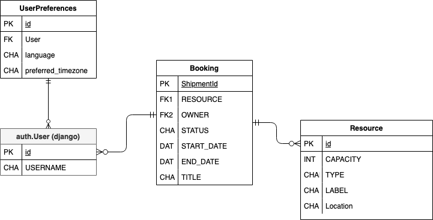

# Reservations
This software allows its users to book resources for a given time.

## installation
This software has been developed under python3.6. To install run the 
following commands:

```shell
virtualenv -p python3.6 env
source env/bin/activate
pip install -r requirements.txt
export DEBUG=false
python manage.py migrate
python manage.py collectstatic --noinput
python manage.py loaddata fixtures/superusers.json
```

## Features
- Admin access to create resources
- User can create a "booking"
- User can view his past, present and future bookings 
- User can cancel one of his upcoming/current bookings

## Database
The project's database is simple and relies on three models:

- Users
- Resources
- Bookings (binding users and resources)

The chosen database is sqlite for installation simplicity but if this had to
run under production constraints I would certainly reconsider this choice.

The following diagram sums thigs up:

 
## Foreseen limitations
This project doesn't have resources over-use protection and probably won't
unless explicitly requested.

## Using the app
You can connect the app admin interface using the following credentials:

| username | password    |
|----------|-------------|
| admin    | MyAdmin123! |
